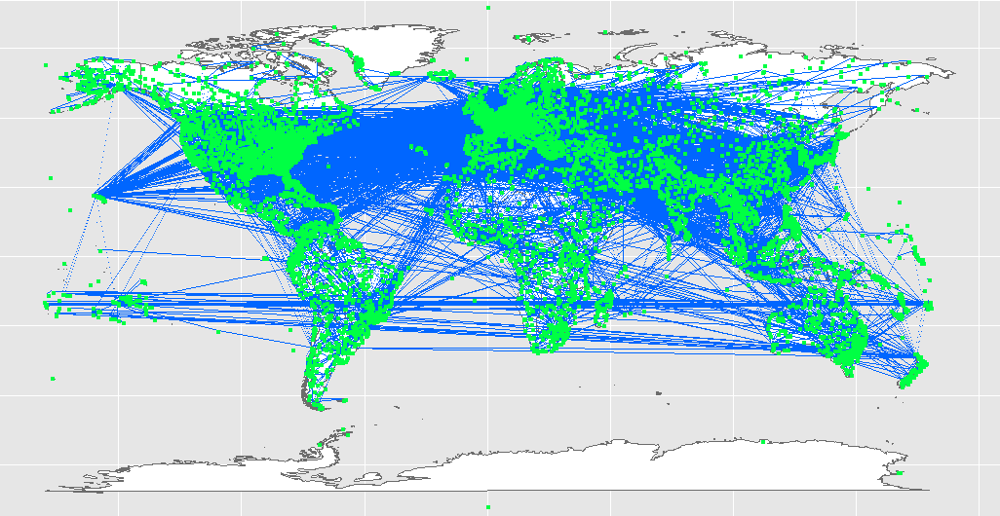
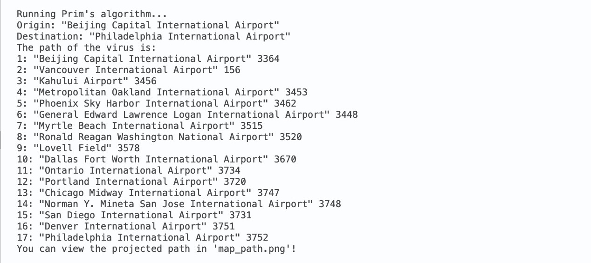
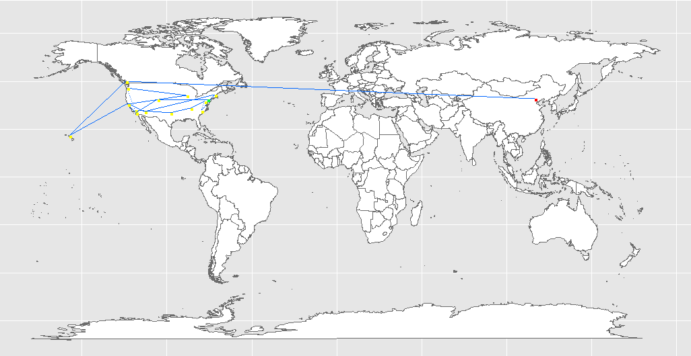
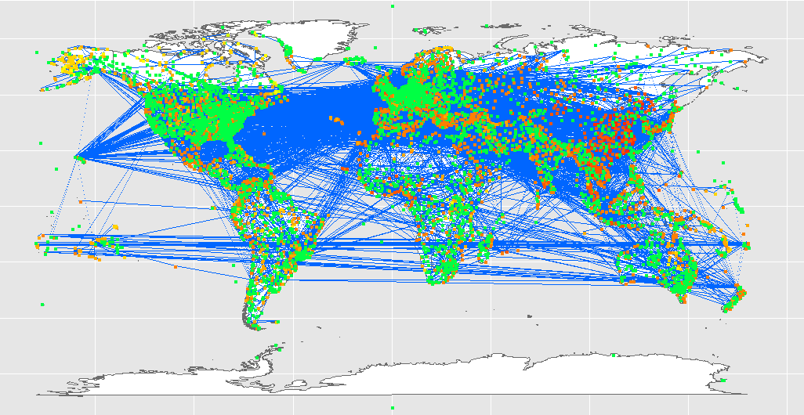

# Results

## taige2-xinyih8-tkimura4-rl17

### Our goals

#### Project Background

- Over the last two years, COVID 19 has been an extreme problem around the world. Suppose there is an unknown virus outbreak somewhere in the world just like COVID 19 in the future, how do we limit the spread of this virus?

#### Goals

- For this project, we are trying to simulate the spread of an unknown virus through airports and airlines. There are mainly three goals.
  
1. The first goal is to implement BFS traversal that iterates through the graph given a starting point.
2. The second goal is to find a path that the virus is most likely to take from an origin to a destination, and we would like to implement Prim’s algorithm to help us achieve this goal.
3. Last goal is map projection. We will project our graph onto an image for better visualization. We are building two types of projections. The first one is simply projecting all the nodes and vertices onto the map regardless of the starting point, while the second one is coloring the nodes based on its distance from the starting point to represent the transmissibility of the virus.

### Output and a complete run of all algorithms

#### Main

To run main, type in `make && ./finalproj argv[1] argv[2] argv[3] argv[4]` 

##### Input validity

- In our main executes that takes in four inputs, the program would first check the validity of these inputs: check if the files exist and whether IDs are integers. If the inputs are invalid, the program will stop and print the error of the input.

##### Graph creation and simple map projection

- If all inputs are valid, our program will then create a Graph object with the filenames in strings as arguments. When the graph object is sucessfully created, the program would run the first projection function `mapToImage()` and project this graph to the PNG file `map_graph.png`
- Here is our output with full datasets

##### Prim's algorithm

- Then, our program uses the function `Graph::getAirport(int id)` to get the origin Airport pointer and the destination Airport pointer. We first check if both Airports exist in our graph, then run the function `Graph::destionationPath(Airport source, Airport destination)` to find the path. This path will be returned as a vector int, and we then print all the Airport's name and id. 

- If we find out that there is no path from the origin Airport to the Destination Airport, our main will print out the message `"Virus will not reach airport B!"`
- Subsequently, our prorgam will project this path to a PNG file `map_path.png` with the function `Graph::mapPath()`. The node with color red represents the origin Airport, the yellow colored nodes represent the airports that the virus passes, and the green airport represents the final destination.
- 

#### Map Projection and Traversal

- Lastly, we are about to project our graph with the virus transmissbility to the image. But before that, we will first create a BFS object, and starts traversing from the starting point. This marks the heights for all the nodes, and for how it works, please look at the Proof and Test cases section. 
- After traversing the entire graph, we can call the function `Graph::mapTrans()` which generates an image. Our program then writes this image to the PNG file `map_trans_graph.png`

- Those nodes with higher concentration of redness are those airports that have the most direct contact with the origin airport. Those airports with orange color are in better conditions, and those in green barely have any contact with the virus.

### Proof & Test cases

#### Test Cases

There are four types of test cases we wrote, and you can run a specific type of test case

##### Test Graph Construction

- `make && ./test [graph_default]`
- There are three test cases for this type
- The first one is testing the default constructor and the last two are checking the custom constructors with small datasets and large datasets
- We check if our graph creates the correct number of airport and airline pointer objects
- This require the number of airport and airline created to be less than the datasets provided since a few data will be deleted if they are incomplete
- This also tests the functions `getAirlineCount()` and `getAirportCount()`

##### Test BFS Iteration

- `make && ./test [bfs]`
- There are four test cases for this type
- This is very similar to the BFS tests from MP Traversals
- We first check the function `begin()` and see if `*it` returns the starting point correctly
- We then check incrementing our iterator once and twice to check if our class iterates the graph as expected
- Lastly we check `.end()` by writing an enhanced for loop. Then compare it with the expected traversing path we got from the datasets

##### Test Prim's Algorithm

- `make && ./test [prim]`
- There are four test cases for prim
- We first check a path without any branch and validates that the output path is the same as expected
- We then check if prim returns an empty vector if the destination airport does not exist
- The third one tests with large datasets and see whether the function returns a vector with just the source and destination airports if there is a direct flight.
- Last test checks the projection of this path to the map, and check the function `mapPath()`
- The output can be viewed in in `results/test_images/mapped_path.png`

##### Test Map Projection

- `make && ./test [map_proj]`
- There are four test cases for map projection
- The first two test cases check the simple projection with small and large datasets
- The last two test cases check the projection transmissibility with small and large datasets
- The output of these tests can be viewed in `results/test_images/mapped_[].png`

#### Algorithms & proof

##### Graph Construction

- Our graph constructor will run functions we wrote in `readFromFile`. This reads the strings in the given file, and then returns `vector<vector<string>>` with each vector contains a vector of information stored in string.
- Our constructor is successful because we wrote lines that check if the information in each vector is what we want. If the information at an index is blank or has the wrong type, we would ignore this line of data.
- Other functions except for a few that we will explain later are merely getter and setter functions that modify or get private varibales.
- From the graph_default test cases we have illustrated earlier, we know that the graph constructor produces the right graph.

##### BFS Traversal

- Our BFS traversal is very similar to the traversal we wrote in the MP Traversal assignment, except that for each airport, we would add all the destinations. 
- We wrote our Airport and Airline as separate classes in order for us to implement them in BFS class directly
- It also marks the height for each airport, and we would utilize this in Map Projection later.
- We know that this works with the test cases we wrote and explained earlier. This is also verified when we implement BFS traversal in Map Projection, when the graph successfully generates correct color for each height. The map projection would not have succeeded without a proper BFS traversal. We will show proof for map projection in the later section.

##### Prim's Algorithm

- We applied a partial Prim's algorithm search such that we do not aim to find a minimum spanning tree that has all the aiports connected. Instead, we would stop the algorithm when the destination airport is found
- Then function still uses a set of vertices and a set of edges for construction, and we will always begin from the source aiport as the first vertex in the system.
- Then we will look through all the edges that is adjacent to the initial vertex and record their weight respectively. On top of that, since the graph is directed, we will also store information about the previous vertex where the edge is connected to so that we can construct a reversable path in the end.
- Upon finding a suitable vertex (does not exisit in the final vertex set) that has an edge with the minimum weight, we will add it to the final vertex set and let it be the new current vertex. The process continues until the current vertex equals to the final destination airport.
- Then the function will construct a reversable path according to the pervious node stored and generate a path from the souce airport to the destination airport and this path will have a minimum weight since it is constructed using Prim's Algorithm.
- We have presented test cases from simple path to path generated by the larger datasets. In our main executable, the program also has a valid path from our `destinationAirport()` function. 

##### Map Projection

- Our Map projection utilizes the cs225 namespace and the PNG class. We have been using the PNG class since the first assignment, so we decided to use this class to map our nodes to an World map png.

- Simple Projection
  - We have three helper methods
    - `Graph::long_to_x(PNG & image, Airport * p)` 
      - This function converts airport's longitude to a x coordinate
    - `Graph::lat_to_y(PNG & image, Airport * p)` 
      - This function converts airport's latitude to a y coordinate
    - `Graph::drawLine(PNG & png, Airport * a, Airport * b)`
      - This function draws line between two nodes
  - We tried projecting just a few nodes to projecting full datasets to the graph, and about 90% of the nodes are at their proper location.
  - Less than 10% of the nodes have improper location because our functions turns the geographical coordinate into a rectangular image coordinate, rather than an elliptical image coordinate. Those nodes near the poles are more likely to shift compared to others
  - About 90% of the lines are properly connected, except for those connecting nodes at West of South America to Insular Regions. The actual airline is going left from South America, while our edge line is going right from South America.
  - As the datasets increase in size, the number of overlapping region also increases, we realize there's no proper way to correctly address this issue given the extremely large dataset.
- Projection with transmissibility
    - This is very similar to the Simple Projection, but some of the nodes have different colors. With simple test cases, we have shown that the airports that have direct flight with the origin airport has the highest concentration of red, and airports that are further away have more orangeness and greenish color. 
    - This is based on the height of the nodes from the origin airport. The higher the node, the higher the hue, meaning it has a color toward green rather than a red color.

### Discoveries

- After discovering a virus at an airport, our program can figure out all the airports that are highly likely to get infected by this unknown virus through airlines. We are also able to produce a visual graph that could help us to understand and predict the virus' behavior. Even though our project cannot precisely anticipate the virus's path, it can be used to estimate the overall result and assist the officials to make effective decisions in reducing the damage.
- At the end of this project, we now have a better understanding of graphs and discovered many interesting things about it. For example: we used to believe that the surrounding airports would definitely have higher chances of getting infected. However, the results show that even if two airports are geographically close to each other, there is the possibility that the virus will never arrive at this airport when there is no edge connecting them. Furthermore, we are now aware of the challenges with real-world datasets. There are many ways that a data could be different from another, and we need to deal with these kinds of exceptions.
- In the future, when we are dealing with this kinds of project again, we are thinking of going further. For example, providing different kinds of parameters for the user to decide, and outputs different results based on the type of weight the user inputs.  
- In the end, all members in the team had a pleasant time working with each other. Although this semester has been online, and we could not work on this project like previous semesters, we have had a completely different experience that has improved our skills in many ways, such as communicating with others through technologies, constant commit and push on git, regular meet and emergent meet, which are necessary skills for us to become better at either the industry or continue education. 